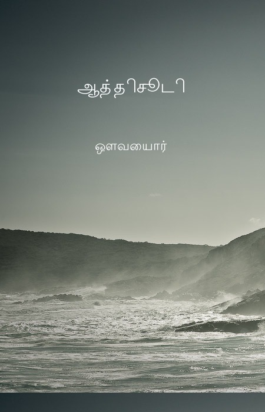
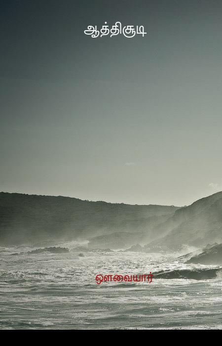

# ProjectMadurai

http://projectmadurai.org/pmworks.html

Project madurai takes title and author of above url. it will create cover page image for each title and author.

## How it works

It takes all title and author from above url using Nokogiri. For each title and author, it create html file and take screenshot with help of phantomjs

Currently we are using RMagick ( or other image processing tool )

## Installation

### Installing Phantomjs. This is required*

Check how to install from below link
http://phantomjs.org/download.html

### Install project_madurai gem

    $ gem install project_madurai

## Usage

    $ project_madurai extract

### if you have custom image to be shown
    
    $ project_madurai extract --image /path_of_image

## Demo

#### Previous version with RMagick

#### Current version with PhantomJs

## Contributing

1. Fork it ( https://github.com/[my-github-username]/project_madurai/fork )
2. Create your feature branch (`git checkout -b my-new-feature`)
3. Commit your changes (`git commit -am 'Add some feature'`)
4. Push to the branch (`git push origin my-new-feature`)
5. Create a new Pull Request
